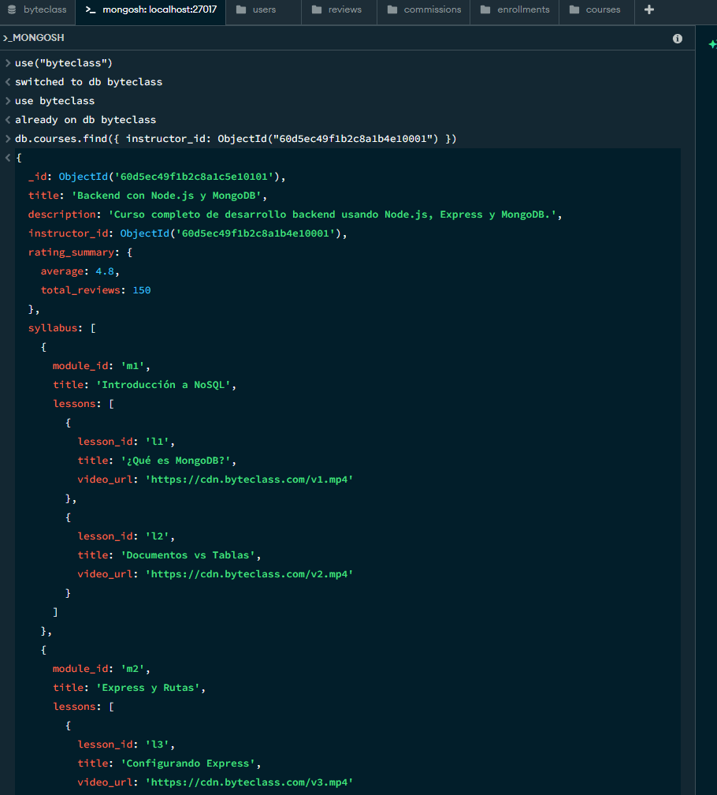
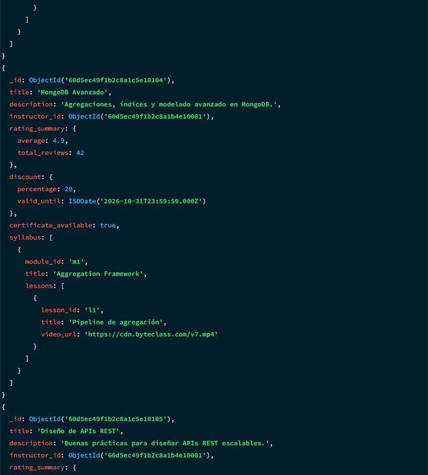
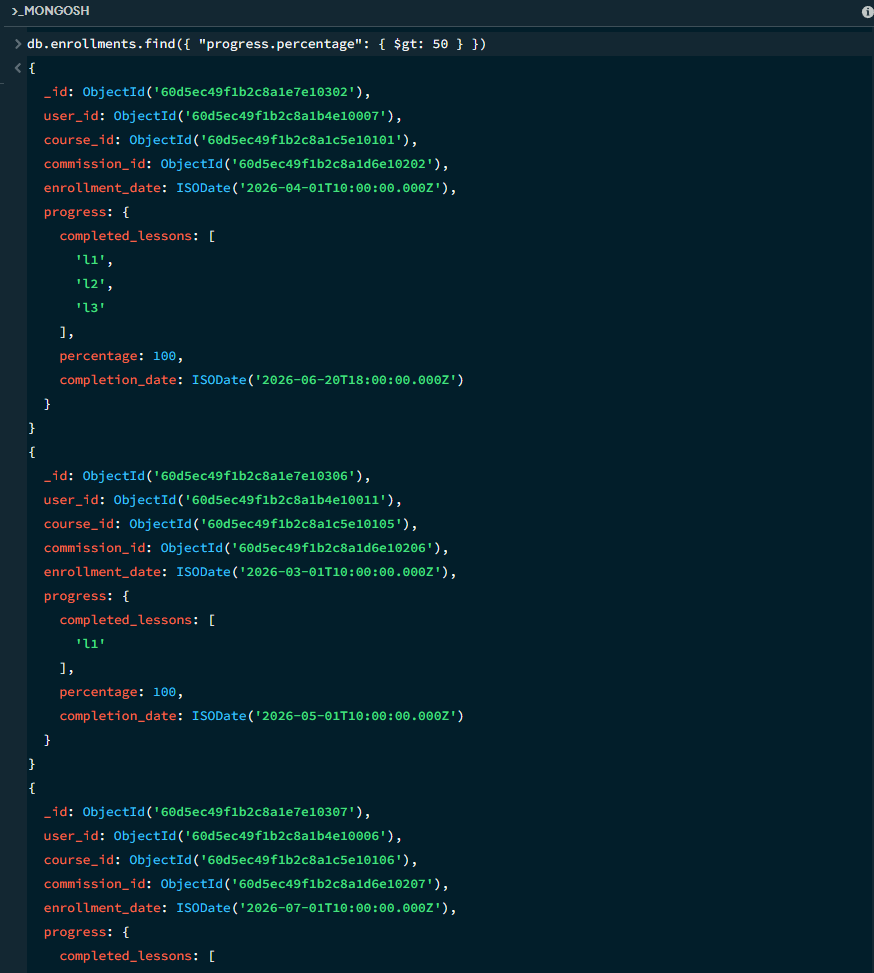
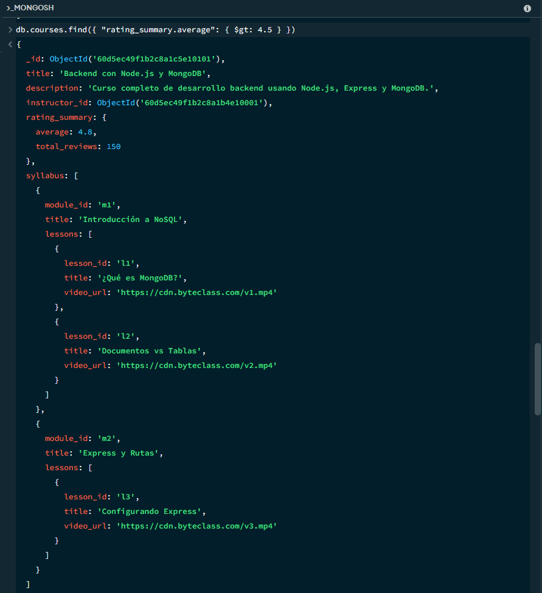
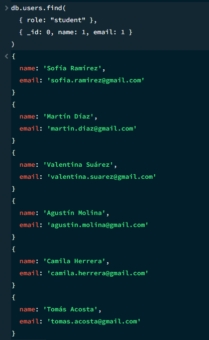
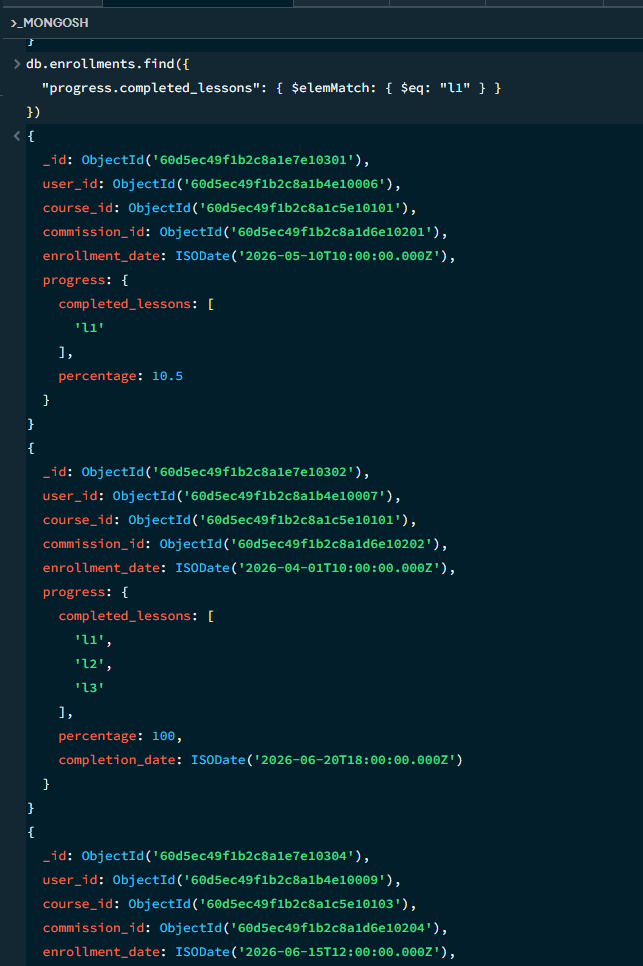
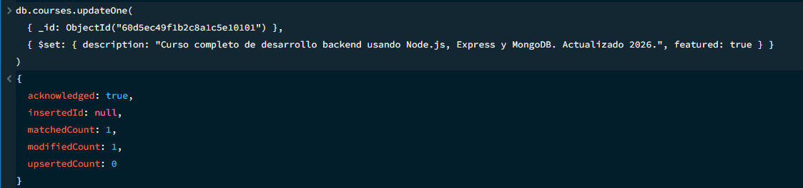
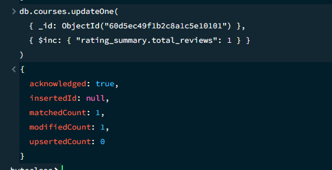
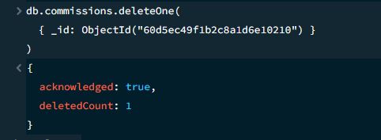

## Fase 2: Implementación, Sembrado de Datos y Consultas CRUD

### Consultas de Lectura

**1. Filtrado básico por coincidencia exacta**
```js
db.courses.find({ instructor_id: ObjectId("60d5ec49f1b2c8a1b4e10001") })
```
Resuelve: mostrarle a un instructor el listado de sus propios cursos en el panel.




**2. Operador de comparación ($gt)**
```js
db.enrollments.find({ "progress.percentage": { $gt: 50 } })
```
Resuelve: identificar alumnos con avance mayor al 50% para ofrecerles contenido adicional o el certificado.



**3. Notación de punto sobre campos anidados**
```js
db.courses.find({ "rating_summary.average": { $gt: 4.5 } })
```
Resuelve: armar el catálogo de cursos mejor valorados en la home de la plataforma.



**4. Proyección de campos específicos**
```js
db.users.find({ role: "student" }, { _id: 0, name: 1, email: 1 })
```
Resuelve: generar un listado liviano de contacto de alumnos sin exponer datos sensibles.



**5. Filtrado dentro de un arreglo ($elemMatch)**
```js
db.enrollments.find({ "progress.completed_lessons": { $elemMatch: { $eq: "l1" } } })
```
Resuelve: saber cuántos alumnos completaron una lección puntual, para estadísticas de contenido.



### Operaciones de Escritura

**1. Actualización con $set**
```js
db.courses.updateOne(
  { _id: ObjectId("60d5ec49f1b2c8a1c5e10101") },
  { $set: { description: "...", featured: true } }
)
```
Resuelve: destacar un curso en el catálogo desde el panel de administración.



**2. Actualización atómica con $inc**
```js
db.courses.updateOne(
  { _id: ObjectId("60d5ec49f1b2c8a1c5e10101") },
  { $inc: { "rating_summary.total_reviews": 1 } }
)
```
Resuelve: mantener el contador de reseñas actualizado sin recalcularlo desde cero.



**3. Eliminación segura con deleteOne**
```js
db.commissions.deleteOne({ _id: ObjectId("60d5ec49f1b2c8a1d6e10210") })
```
Resuelve: dar de baja una comisión puntual sin riesgo de borrar otras por error.


